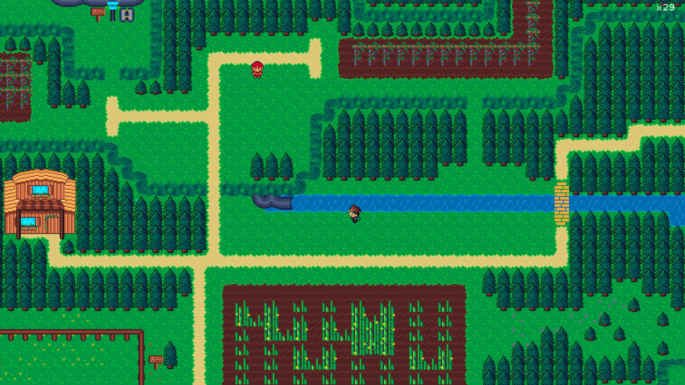
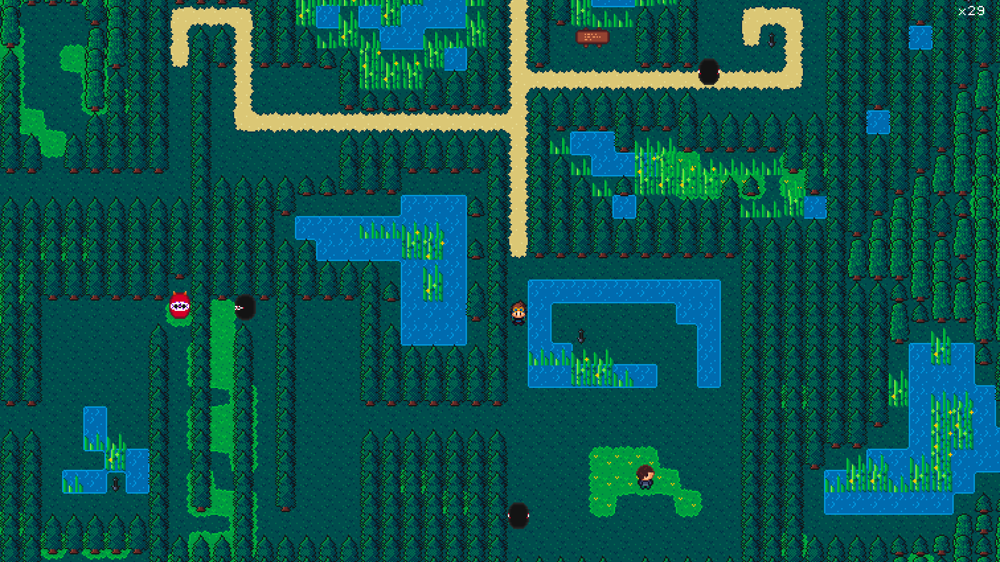
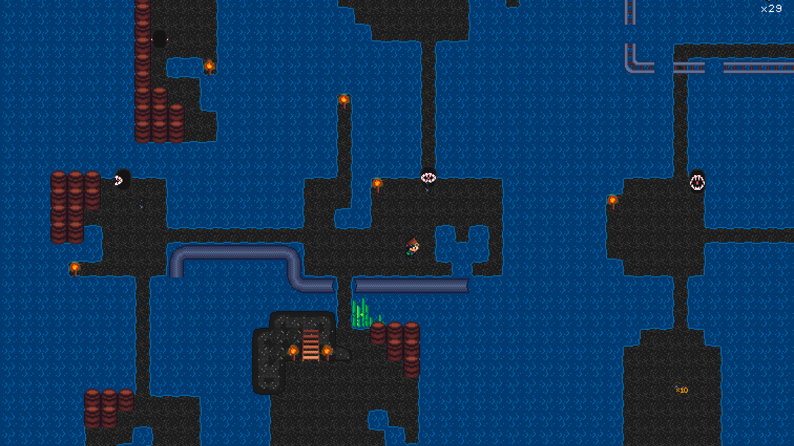
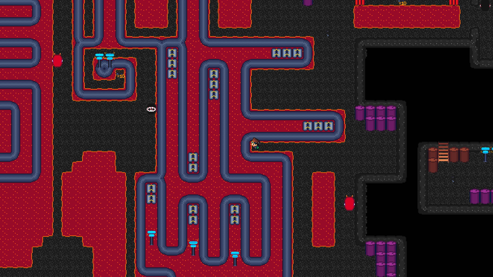
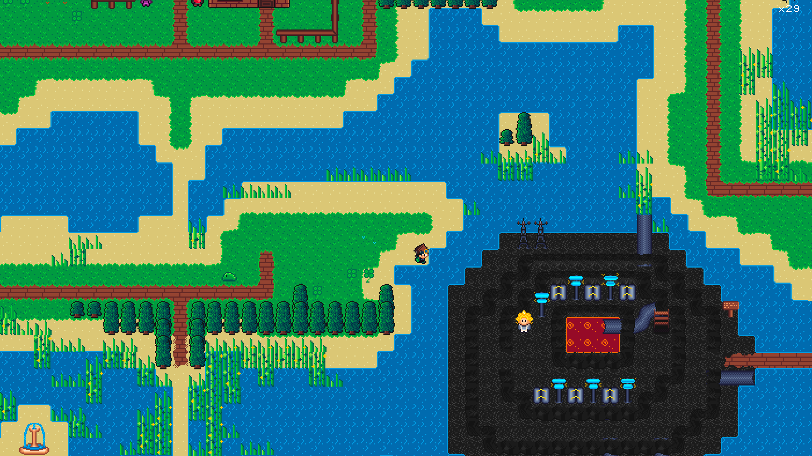

### [Play it now, no install](https://sneakbit.curzel.it)

SneakBit is a top-down adventure-action game with close- and long-range combat, a
hand-drawn Gameboy-style world, and a story to wander through. 

The game was initially written in Rust, but has now fully been ported to HTML5 and JS.\



## Features

* Adventure-action gameplay with melee (sword) and ranged (kunai) combat
* Pre-rendered dual-layer tiling system - biomes, constructions, animated objects
* Tile-locked, Gameboy-style movement (see [Movement model](#movement-model))
* **Online co-op and Pvp** - up to four players share one world over WebRTC ([docs/multiplayer.md](docs/multiplayer.md))
* **Local Split Screen** - up to four players on one machine, one controller each
* Keyboard and gamepad/controller support

## Running it

No build step for development - serve the folder with any static HTTP server
(browsers block `fetch` on `file://`) and it loads the raw ES modules straight
from `js/`:

```bash
npm run serve            # node tools/serve.mjs (port 8000)
# or
npx http-server -p 8000
```

Then open <http://localhost:8000>.

Production *is* bundled: `npm run build` (esbuild, the only devDependency) writes
a content-hashed single-file bundle into `_site/`. That's what ships - the public
build at <https://sneakbit.curzel.it> is deployed from the VPS via
`npm run deploy`. Dev and the e2e harness never touch the bundle; only deploys
do.

## Tests

```bash
npm run test:unit        # fast inner loop (~2 s) - node --test
npm run test:e2e         # full e2e suite (~26 s; needs Chrome)
npm test                 # both, sequential
```

Tests have no dependencies of their own - unit tests use Node's built-in test
runner. E2E tests drive headless Chrome via raw CDP and self-skip if Chrome isn't
on the path. (The repo's one devDependency, esbuild, is for the production build
only - `npm ci` is needed to build, not to test.)

## Credits

* Art, design, and original code by [Federico Curzel](https://github.com/curzel-it)
* Music by [Filippo Vicarelli](https://www.filippovicarelli.com/8bit-game-background-music)
* Sound effects by [SubspaceAudio](https://opengameart.org/content/512-sound-effects-8-bit-style)
* Font by [HarvettFox96](https://dl.dafont.com/dl/?f=pixel_operator)

## Contributing

PRs welcome - see [CONTRIBUTING.md](./CONTRIBUTING.md) and [CODE_OF_CONDUCT.md](./CODE_OF_CONDUCT.md).

## License

[MIT](./LICENSE) for the code in this repo. Third-party assets keep their original licenses (see Credits above).

## More screenshots
 

 

